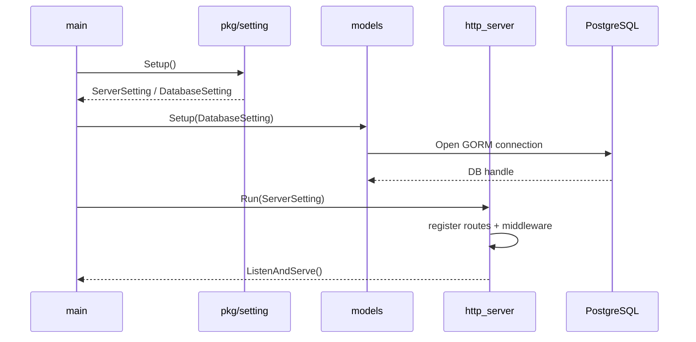
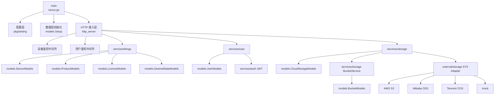
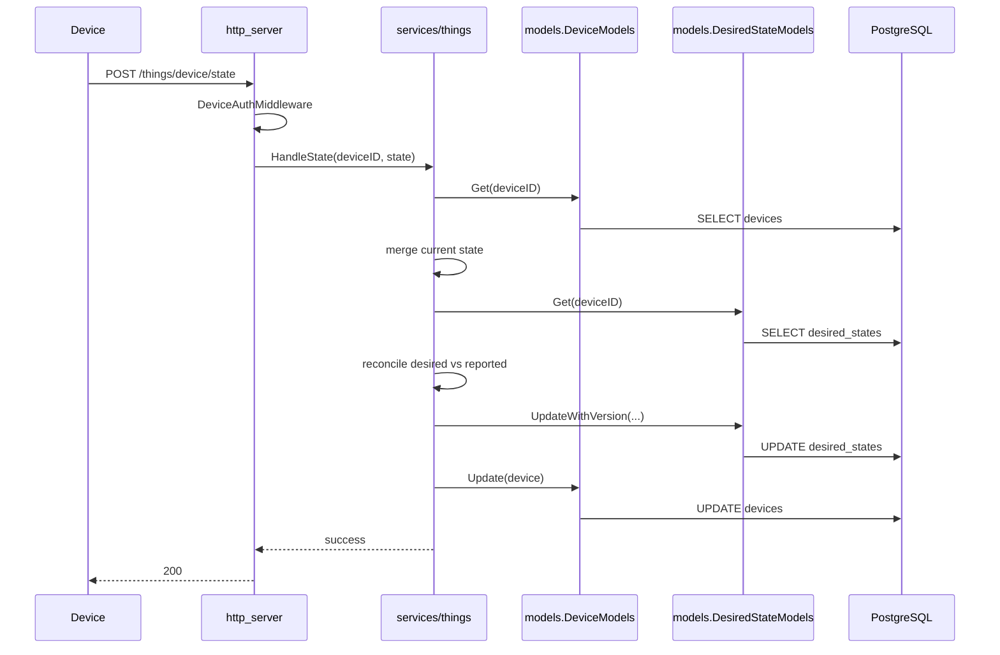

# Nexus 架构文档

本文档描述 `Nexus` 仓库当前代码实现对应的系统架构，重点覆盖：

- 系统定位与边界
- 启动流程与运行时依赖
- 核心模块依赖关系
- 关键业务调用链
- 按目录拆分的职责说明与改进建议

本文档基于当前仓库实现整理，更偏向“现状架构说明”而不是未来规划。

## 1. 系统概览

`Nexus` 是一个基于 Go 的单体 IoT 后端，主要围绕以下能力展开：

- 设备激活与设备身份校验
- 设备当前状态上报
- 设备期望状态管理与自动对账
- 云存储配置查询与临时凭证下发
- 用户注册、登录与资料查询

技术栈如下：

- Web 框架：`gin`
- ORM：`gorm`
- 数据库：`PostgreSQL`
- 配置：`ini`
- 认证：`JWT` + 设备侧 HMAC
- 外部对象存储：`AWS S3` / `阿里云 OSS` / `腾讯云 COS` / `mock`

从运行形态看，当前项目是一个典型的单体服务：

- `main` 负责启动
- HTTP 服务作为唯一对外入口
- 数据库作为主状态存储
- 对象存储厂商通过适配层接入
- 当前没有独立 worker、消息消费进程或内部 RPC 服务

## 2. 启动流程

程序入口很薄，启动顺序固定：

1. 加载服务配置 `conf/app.ini`
2. 初始化 PostgreSQL 连接
3. 注册 Gin 路由和中间件
4. 启动 HTTP Server

对应代码：

- [`nexus.go`](./nexus.go)
- [`pkg/setting/setting.go`](./pkg/setting/setting.go)
- [`models/models.go`](./models/models.go)
- [`http_server/http_route.go`](./http_server/http_route.go)

启动时序图：



## 3. 模块分层

当前架构可以抽象成 6 层：

1. 入口层：程序启动与组件初始化
2. 配置层：加载服务侧和设备侧配置
3. 接入层：HTTP 路由、鉴权、中间件
4. 业务层：设备、用户、存储、录制等业务服务
5. 数据访问层：GORM model 与 CRUD 封装
6. 外部适配层：对象存储与 STS provider 抽象

整体依赖图如下：



## 4. 核心领域说明

### 4.1 设备域 `services/things`

设备域是当前项目的核心领域，负责：

- 设备激活 `Active`
- 设备停用 `Deactivate`
- 设备详情与列表查询
- 设备状态上报 `HandleState`
- 设备期望状态拉取 `FetchDesiredState`
- 设备期望状态设置 `SetDesiredState`

这一层的最大特点是：

- 当前状态 `State` 使用 JSON 文档表达
- 期望状态 `DesiredState` 也使用 JSON 文档表达
- 字段级版本信息放在业务层结构体中管理，而不是拆成多张关系表

关键代码：

- [`services/things/things.go`](./services/things/things.go)
- [`services/things/state.go`](./services/things/state.go)
- [`services/things/device.go`](./services/things/device.go)
- [`IOT_CORE_STATE_SYNC.md`](./IOT_CORE_STATE_SYNC.md)

### 4.2 用户域 `services/user`

用户域目前相对简单，主要负责：

- 用户注册
- 用户登录
- 用户详情查询
- 用户搜索和基础资料更新

JWT 的生成和校验由 `services/auth` 提供。

关键代码：

- [`services/user/user.go`](./services/user/user.go)
- [`services/auth/jwt.go`](./services/auth/jwt.go)

### 4.3 存储域 `services/storage`

存储域负责：

- 查询设备绑定的存储配置
- 查询 bucket 元信息
- 为设备生成对象存储临时凭证

这层本质上是一个“业务配置 + provider 适配器”的编排层。

关键代码：

- [`services/storage/cloud_storage.go`](./services/storage/cloud_storage.go)
- [`services/storage/bucket.go`](./services/storage/bucket.go)
- [`external/storage/sts.go`](./external/storage/sts.go)
- [`external/storage/storage.go`](./external/storage/storage.go)

### 4.4 录制域 `services/recording`

录制域已经有服务与数据模型，但目前还没有接入主 HTTP 路由。它更像是预留中的业务扩展模块。

关键代码：

- [`services/recording/cloud_recording.go`](./services/recording/cloud_recording.go)

## 5. 数据模型

数据库核心实体包括：

- `devices`：设备主表
- `desired_states`：设备期望状态表
- `users`：用户账号表
- `products`：产品定义
- `licenses`：设备激活凭证
- `buckets`：存储桶元数据
- `cloud_storages`：设备与存储桶的绑定关系
- `cloud_recordings`：云录制数据
- `cloud_recording_plans`：云录制计划
- `messages`：消息中心

Schema 初始化见：

- [`scripts/init_schema.sql`](./scripts/init_schema.sql)

一个重要设计点是：`desired_states` 不是多行表示多条命令，而是“一台设备一行 JSON 文档”，并通过 `version` 做乐观锁控制。

对应实现：

- [`models/desired_state_models.go`](./models/desired_state_models.go)

## 6. 关键调用链

### 6.1 用户登录链路

```text
POST /cloud/account/sign_in
  -> http_server.signIn
  -> services/user.SignIn
  -> models.UserModels.GetByAccount
  -> services/auth.GenerateToken
  -> 返回 JWT
```

### 6.2 设备激活链路

```text
POST /things/activate
  -> http_server.activateDevice
  -> services/things.Active
  -> 校验 license
  -> 校验 product.required_features
  -> 生成 device_id / secret_key
  -> models.DeviceModels.Create
  -> 返回 IoTDevice
```

### 6.3 设备状态同步链路

状态同步是当前项目最重要的业务链路。



这条链路的几个关键点：

- 设备上报的是“当前真实状态”
- 服务端会把上报值合并进现有状态
- 如果上报值携带了与期望状态一致的版本标记，则会自动删除已完成的期望字段
- `desired_states.version` 用于避免并发覆盖

### 6.4 存储凭证下发链路

```text
GET /things/device/credentials
  -> DeviceAuthMiddleware
  -> http_server.generateGetStorageCredentials
  -> services/storage.GetStorageCredentials
  -> models.CloudStorageModels.GetByDeviceID
  -> services/storage.BucketService.GetBucketByName
  -> external/storage.StsService.GenerateCredentials
  -> 返回分 provider 的临时凭证
```

## 7. 认证设计

### 7.1 设备认证

设备接口认证由 `DeviceAuthMiddleware` 完成，流程如下：

1. 从请求头中读取 `device-id` 和 `digest`
2. 查询设备对应的 `secret_key`
3. 用 `secret_key` 计算 HMAC
4. 比较计算结果与请求头中的 `digest`

代码位置：

- [`http_server/http_route.go`](./http_server/http_route.go)

### 7.2 用户认证

用户接口认证由 `UserMiddleware` 完成：

1. 从 `Authorization: Bearer <token>` 获取 JWT
2. 通过 `services/auth.ValidateToken` 校验
3. 将 `user-id` 写入 Gin context

代码位置：

- [`http_server/http_route.go`](./http_server/http_route.go)
- [`services/auth/jwt.go`](./services/auth/jwt.go)

## 8. 目录职责与改进建议

### 根目录

#### `nexus.go`

职责：

- 程序入口
- 串联配置加载、数据库初始化、HTTP 服务启动

改进建议：

- 当前入口足够薄，可以继续保持
- 如果后续引入更多基础设施组件，可考虑显式初始化 `app` 容器对象，而不是继续堆叠全局初始化

#### `README.md`

职责：

- 项目对外说明与快速上手

改进建议：

- 增加对本架构文档和 API 文档的索引
- 明确区分“当前已实现能力”和“规划中能力”

### `http_server/`

职责：

- 注册所有 HTTP 路由
- 承载设备和用户认证中间件
- 负责请求绑定、错误响应和 service 调用

优点：

- 路由集中，入口清楚
- 阅读成本低

改进建议：

- 当前 `http_route.go` 集中了路由、中间件、handler 和响应结构，职责偏重
- 可以拆分为：
  - `routes`
  - `middleware`
  - `handlers`
  - `response`
- 更利于后续扩展和测试

### `pkg/setting/`

职责：

- 读取服务侧配置 `app.ini`
- 读取设备侧配置 `things.ini`

优点：

- 设备配置和服务配置有明确分离

改进建议：

- `things_config.go` 当前在 `init()` 中加载，和主启动流程是两条线
- 建议统一由显式 `Setup()` 驱动，减少隐式初始化
- 增加环境变量覆盖机制，便于部署

### `models/`

职责：

- 定义数据库模型
- 提供 GORM CRUD 封装
- 管理全局 DB 连接

优点：

- service 依赖的是接口，测试里可以很方便地 mock

改进建议：

- 当前部分查询使用 `Find`，部分使用 `First`，风格不统一
- 可以进一步抽出 repository 层约束分页、排序、过滤行为
- 全局 `db` 简单直接，但会让初始化和多数据库场景扩展受限

### `services/things/`

职责：

- 设备激活
- 设备停用
- 设备详情查询
- 状态上报
- 期望状态管理
- 设备能力描述

优点：

- 是项目最完整的领域模块
- 状态和期望状态的业务规则较集中

改进建议：

- `things.go` 文件承载了过多职责
- 建议按子领域拆分：
  - `activation`
  - `device query`
  - `state sync`
  - `desired state`
- `HandleEvent` 还是空实现，应尽快明确事件模型，否则接口会长期失真

### `services/user/`

职责：

- 用户注册、登录、查询和更新
- 消息结构转换

优点：

- 逻辑简单直接

改进建议：

- 密码校验当前仍是明文比较，应升级为哈希存储和校验
- 可以把 DTO 和 service 逻辑进一步拆开，降低文件体积

### `services/auth/`

职责：

- JWT 生成和校验

改进建议：

- `secretKey` 和 `issuer` 当前是硬编码
- 建议改为配置项或密钥管理方案
- 如果以后有多终端、多应用接入，可以引入更明确的 claims 设计

### `services/storage/`

职责：

- 存储配置查询
- bucket 管理
- STS 凭证编排

优点：

- 业务配置和 provider 调用分层较清晰

改进建议：

- 可以补齐更多输入校验和异常类型
- `CloudStorageService` 里有一些集合拼装逻辑，后续可抽成更小的 helper

### `services/recording/`

职责：

- 云录制开始、结束与查询

现状：

- 服务和模型已存在
- 但没有接入 HTTP 主链路

改进建议：

- 明确是否作为正式能力继续推进
- 如果继续推进，建议补齐接口、状态机和测试覆盖

### `services/license/`

职责：

- license 认证服务

现状：

- 与 `services/things` 中的激活认证逻辑存在重复

改进建议：

- 把认证逻辑统一收敛到一个服务里
- 避免未来出现两套实现不一致

### `services/app/`

职责：

- 当前仅保留目录结构

改进建议：

- 如果近期没有应用接入能力，建议删除空目录或补充说明
- 如果要保留，建议明确边界，例如：
  - 应用凭证管理
  - 第三方接入管理
  - OpenAPI 客户端身份管理

### `services/device_features/`

职责：

- 预留的设备能力校验层

现状：

- 当前实现为空壳

改进建议：

- 可以逐步把 `things.Features` 中的校验逻辑迁移到这里
- 形成独立的设备能力规则模块

### `services/geo/`

职责：

- 预留的 GeoIP 查询能力

现状：

- 当前未实现

改进建议：

- 明确是作为通用工具层还是业务能力层
- 如果短期不用，建议避免在主链路中保留未落地依赖

### `external/storage/`

职责：

- 多云对象存储 provider 适配
- STS 策略组装
- 预签名 URL 与对象列表能力

优点：

- 抽象边界清楚
- 易于扩展新 provider

改进建议：

- 当前 AK/SK/RoleArn 等仍是硬编码占位值
- 应尽快改为配置化或接入密钥管理
- 可以继续拆分“策略构造”和“SDK 调用”两层

### `conf/`

职责：

- 本地运行配置

改进建议：

- 增加示例文件说明
- 区分开发、测试、生产配置策略

### `scripts/`

职责：

- PostgreSQL 初始化
- API 辅助测试
- 开发环境准备

改进建议：

- 保持脚本与实际路由、schema 一致
- 当前有部分文档示例和代码实际行为已经存在漂移，建议定期收口

### `examples/`

职责：

- 提供配置和启动示例

改进建议：

- 示例应尽量与主工程现状保持一致
- 如果示例仅用于调试配置，可考虑精简

### `test/`

职责：

- model 层和 service 层测试

优点：

- 当前 `services` 和 `models` 已有基础测试覆盖

改进建议：

- 建议补少量 HTTP 层集成测试
- 建议增加 PostgreSQL 真实交互测试，验证 JSON 状态字段和乐观锁行为

### `deps/`

职责：

- 存放本地依赖资产，例如 RabbitMQ 插件

改进建议：

- 如果这些依赖会进入正式能力，应在文档中明确它们和系统主链路的关系

## 9. 当前架构的优点

- 单体结构简单，启动和调试成本低
- 设备域主链路已经形成，尤其是状态与期望状态同步较完整
- service 依赖接口，测试替换成本低
- 对象存储 provider 适配层边界清晰
- 适合作为 IoT 云平台原型和中小型服务基础仓库

## 10. 当前架构的主要风险

- HTTP 层职责偏重，后续扩展容易变成“大文件入口”
- 配置初始化方式不统一，存在隐式加载
- 部分模块仍是骨架，文档、目录与真实能力可能产生认知偏差
- 安全相关实现仍偏开发态：
  - JWT secret 硬编码
  - 用户密码明文比较
  - STS 凭证配置硬编码
- 状态和期望状态用 JSON 文档存储，灵活但会把更多并发与版本复杂度压到业务层

## 11. 后续演进建议

如果继续把这个项目往正式平台推进，建议优先按下面顺序演进：

1. 收口安全实现：JWT、密码、STS 配置
2. 拆分 HTTP 层职责
3. 完成事件链路和录制链路的接入策略
4. 统一配置初始化方式
5. 增加集成测试，覆盖主链路
6. 明确空模块去留，减少“骨架目录”带来的维护成本

## 12. 文档索引

- 项目说明：[`README.md`](./README.md)
- 状态同步设计：[`IOT_CORE_STATE_SYNC.md`](./IOT_CORE_STATE_SYNC.md)
- HTTP API 参考：[`HTTP_API_REFERENCE.md`](./HTTP_API_REFERENCE.md)
- PostgreSQL 初始化：[`POSTGRES_SETUP.md`](./POSTGRES_SETUP.md)
- 使用说明：[`USAGE_SETUP.md`](./USAGE_SETUP.md)
