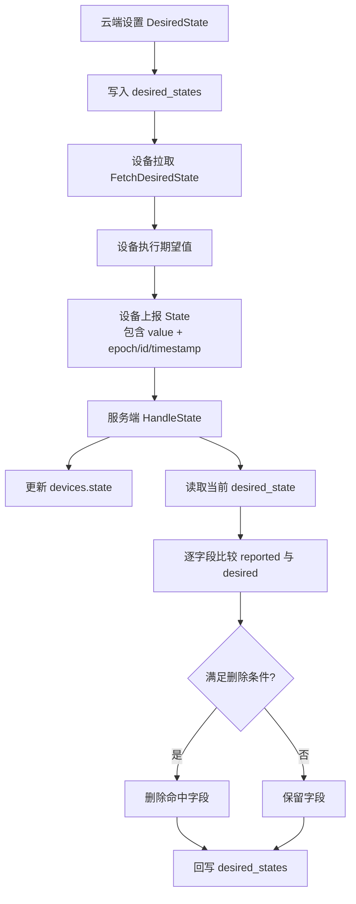
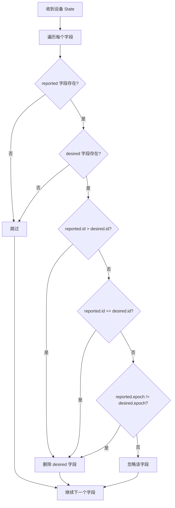

# IoT Core State 同步设计方案

## 目标

本文档描述这套状态同步能力的目标设计：

1. 云端设置期望值
2. 设备拉取期望值并执行
3. 设备上报最新真实状态
4. 云端根据设备上报的字段版本信息，自动删除已完成的期望字段

设计上不依赖“设备单独确认已领取”，而是以“设备上报的真实状态已经明确对应某次期望变更”为准。

## 核心结论

新的推荐模型是：

- `DesiredState` 继续表示“待执行的期望字段集合”
- `DesiredState` 的每个字段增加 `epoch`
- `State` 升级为“真实值 + 已应用的 `epoch + id`”
- 设备执行后，在上报 `State` 时回传对应字段的 `epoch + id`
- 云端在处理 `HandleState` 时，按“先比较 `id`，再按 `epoch` 补充判断”的规则删除 desired

不再建议继续把 `last_id` 作为主确认机制。

原因：

- `last_id` 更像“收到了”，不代表“执行成功”
- 单独确认和真实状态上报是两条链路，容易分叉
- 设备弱网、重试、重启时，`last_id` 很容易造成误删或重复执行

## 为什么引入 `epoch`

当前 `Desired*` 已经有：

- `id`
- `timestamp`

这里采用的前提是：

- `id` 足够大，正常运行时优先依赖 `id`
- `epoch` 允许回滚
- 当 `id` 无法直接说明关系时，再用 `epoch` 做补充判断

这次建议把“时间戳判定”改成“`epoch + id` 判定”：

- `epoch`：当前字段版本代次
- `id`：当前代次内的递增编号

设计语义如下：

- `id` 是字段级主序号
- `epoch` 是字段代次标识
- 删除期望值时，优先比较 `id`
- 当 `reported.id < desired.id` 时，再比较 `epoch`

换句话说，这里的字段令牌从：

- `timestamp + id`

改成：

- `epoch + id`

## 流程图

### 1. 主流程



### 2. 自动对账流程



## 删除逻辑

删除逻辑按字段执行，不再用单独的 `confirm(last_id)` 主导。

以某个字段为例，设备上报 `reported(epoch, id)`，云端当前保存 `desired(epoch, id)`。

### 删除规则

1. 如果 `reported.id > desired.id`，删除该字段的 desired。
2. 如果 `reported.id < desired.id`：
   - 当 `reported.epoch != desired.epoch`，删除该字段的 desired。
   - 当 `reported.epoch == desired.epoch`，忽略这次上报。
3. 如果 `reported.id == desired.id`，删除该字段的 desired。

### 一句话总结

可以把删除条件归纳为：

- `reported.id >= desired.id`，则删除
- `reported.id < desired.id` 时：
  - `reported.epoch != desired.epoch`，则删除
  - `reported.epoch == desired.epoch`，则忽略

更准确一点，比较顺序是：

1. 先看 `id`
2. 只有 `reported.id < desired.id` 时再看 `epoch`

也就是说，这里不再把 `(epoch, id)` 当成严格有序对，而是按业务规则判断：

- `id` 足够大时，以 `id` 为主
- 只有 `reported.id` 落后于 `desired.id` 时，才使用 `epoch`
- 一旦这时发现 `epoch` 不同，就认为当前 desired 已可删除

## 新协议语义

### DesiredState

`DesiredState` 仍是“待执行命令集合”，但每个字段都带：

- `epoch`
- `id`

示例：

```json
{
  "privacy_mode": {
    "value": false,
    "epoch": 3,
    "id": 101
  },
  "volume": {
    "value": 80,
    "epoch": 3,
    "id": 102
  }
}
```

### Reported State

设备上报状态时，不仅上报当前值，还要上报“这个值对应的是哪次 desired 版本”。

示例：

```json
{
  "privacy_mode": {
    "value": false,
    "epoch": 3,
    "id": 101
  },
  "volume": {
    "value": 80,
    "epoch": 3,
    "id": 102
  }
}
```

云端收到后，用“先比 `id`，再按 `epoch` 补充”的规则和当前 `desired` 逐字段比较。

## 数据模型设计

### 1. DesiredState 增加 `epoch`

当前方向可以保留：

- `DesiredVideo`
- `DesiredStorage`
- `DesiredRecord`
- `DesiredVMD`
- `DesiredDecibelDetection`
- `DesiredCruise`
- `DesiredSiren`
- `DesiredVolume`
- `DesiredBoolean`

但每个 `Desired*` 结构都要增加：

```go
Epoch int64 `json:"epoch"`
```

例如：

```go
type DesiredBoolean struct {
	Value *bool `json:"value"`
	Epoch int64 `json:"epoch"`
	ID    int64 `json:"id"`
}
```

### 2. State 需要增加 `epoch + id + timestamp`

推荐做法是：

- `State` 的每个字段都同时带 `epoch`、`id` 和 `timestamp`
- `epoch + id` 表示“设备当前值对应的是哪次 desired 版本”
- `timestamp` 表示设备上报该字段版本的时间

推荐结构如下：

```go
type StateMeta struct {
	Epoch     *int64 `json:"epoch,omitempty"`
	ID        *int64 `json:"id,omitempty"`
	Timestamp *int64 `json:"timestamp,omitempty"`
}

type ReportedVideo struct {
	Video
	StateMeta
}

type ReportedStorage struct {
	Storage
	StateMeta
}

type ReportedRecord struct {
	Record
	StateMeta
}

type ReportedVMD struct {
	VMD
	StateMeta
}

type ReportedDetection struct {
	Detection
	StateMeta
}

type ReportedCruise struct {
	Cruise
	StateMeta
}

type ReportedSiren struct {
	Siren
	StateMeta
}

type ReportedInt struct {
	Value *int `json:"value"`
	StateMeta
}

type ReportedBool struct {
	Value *bool `json:"value"`
	StateMeta
}
```

然后 `State` 改成：

```go
type State struct {
	Video            *ReportedVideo     `json:"video"`
	Storage          *ReportedStorage   `json:"storage"`
	Record           *ReportedRecord    `json:"record"`
	MotionDetection  *ReportedVMD       `json:"motion_detection"`
	DecibelDetection *ReportedDetection `json:"decibel_detection"`
	Cruise           *ReportedCruise    `json:"cruise"`
	Siren            *ReportedSiren     `json:"siren"`
	Volume           *ReportedInt       `json:"volume"`
	PrivacyMode      *ReportedBool      `json:"privacy_mode"`
	NightVision      *ReportedBool      `json:"night_vision"`
	MotionTracking   *ReportedBool      `json:"motion_tracking"`
}
```

这样做的好处是：

- `State` 仍然表示“事实”
- `DesiredState` 仍然表示“待执行”
- `epoch + id` 的语义保持一致
- `timestamp` 可以用于审计、排障和最近一次应用时间展示
- 云端可以精确判断“这次 desired 是否已经被应用”

这里约定：

- desired 删除判断只基于 `epoch + id`
- `timestamp` 不参与删除判定
- `timestamp` 仅作为状态元数据保存

### 3. Device.State 存储内容要同步升级

当前 `devices.state` 存的是旧 `State` JSON。

`devices.state` 需要存新结构，也就是“值 + `epoch + id + timestamp`”。

影响点：

- `services/things/state.go`
- `services/things/things.go`
- `devices.state` 的数据格式定义

## 服务端逻辑设计

### 1. 设置期望值

`SetDesiredState` / `UpdateDesiredState` 继续统一走同一条路径。

生成逻辑改成基于“当前 desired 是否变化”：

- 如果某字段在请求中未出现：保持现状
- 如果某字段出现且值和 existing desired 一致：复用原 `epoch + id`
- 如果某字段出现且值不同：生成新的字段版本

字段版本生成规则：

- 正常情况下：`id++`
- 当 `id` 达到回卷条件时：`id = 0`
- `epoch` 作为字段代次标识单独维护，允许回滚

这里的比较基准优先是：

- 旧的 `desired`

而不是：

- 当前 `reported`

原因：

- `desired` 表示云端目标
- `reported` 表示设备事实
- 设置目标时更应该围绕“目标是否变化”判断是否生成新版本

### 2. 设备拉取期望值

`FetchDesiredState` 继续保留。

语义保持：

- 返回当前未完成的字段级期望状态

设备端规则：

- 如果字段版本已处理过，不重复执行
- 如果字段版本未处理过，则执行并带着同一组 `epoch + id` 回传

### 3. 设备上报真实状态

`HandleState` 要升级成这条链路的核心入口。

流程调整为：

1. 校验请求
2. 读取当前设备
3. 解析旧 `device.State`
4. 合并设备上报的新 `State`
5. 读取当前 `desired_state`
6. 用“先比 `id`，再按 `epoch` 补充”的规则逐字段比较 reported 和 desired
7. 满足删除条件的字段从 `desired_state` 中删除
8. 更新 `devices.state`
9. 如果 `desired_state` 有变化，则同步写回 `desired_states`

这一步可以理解成：

- `HandleState = 更新事实 + 自动完成对账`

### 4. 字段比较 helper

建议新增统一比较器：

```go
func shouldDeleteDesired(reportedEpoch, reportedID, desiredEpoch, desiredID int64) bool
```

实现规则：

1. 如果 `reportedID > desiredID`，返回 `true`
2. 如果 `reportedID == desiredID`，返回 `true`
3. 如果 `reportedID < desiredID`：
   - `reportedEpoch != desiredEpoch`，返回 `true`
   - `reportedEpoch == desiredEpoch`，返回 `false`

然后删除逻辑可以统一写成：

```go
if shouldDeleteDesired(reportedEpoch, reportedID, desiredEpoch, desiredID) {
    // delete desired field
}
```

### 5. ConfirmDesiredState 处理

`ConfirmDesiredState` 不再属于目标设计。

原因：

- 真正可靠的完成信号来自 `reported state`
- 不是来自“我收到了”
- 当前设计已经由 `HandleState` 承担 desired 清理职责

## 设备端配合要求

### 1. 执行期望值时保留云端版本

设备拿到某个 desired 字段后：

1. 执行对应操作
2. 成功后把同一组 `epoch + id` 写入本地状态缓存
3. 同时记录该字段的本地上报时间 `timestamp`
4. 上报状态时把这组版本和 `timestamp` 一起带回云端

### 2. 幂等处理

设备需要本地做字段级去重。

推荐策略：

- 如果同字段收到完全相同的 `epoch + id`，视为同一条命令
- 若此前已成功执行过，则不再重复执行
- 仍可继续正常上报状态

### 3. 失败场景

如果设备执行失败：

- 不要伪造 `epoch/id`
- 仅上报真实值
- 或不上报该字段

这样云端就不会误删该字段的 desired。

## 并发与版本控制

### 1. desired_states 继续使用 version

`desired_states` 的乐观锁机制应该保留，而且要覆盖：

- 设置期望值
- `HandleState` 里自动清理期望值
- 如仍保留 `confirm` 接口时的并发更新

### 2. 重试策略

只对以下错误做重试：

- `desired state version conflict`

不要对这些错误盲重试：

- device not found
- invalid state
- json parse error
- inactive device

## 实现顺序

### 阶段一：完成模型定义

改动：

1. `DesiredState` 增加字段级 `epoch`
2. `State` 增加字段级 `epoch/id/timestamp`
3. `HandleState` 增加自动对账逻辑
4. `FetchDesiredState` 不变

### 阶段二：完成设备协议实现

改动：

1. 设备固件开始回传字段版本
2. 设备不再依赖 `last_id` 作为完成语义
3. 停止使用 `ConfirmDesiredState`

结果：

- 云端清理 desired 的主路径固定为 `HandleState`

### 阶段三：删除旧 confirm

改动：

1. 删除 `/things/device/state/desired` confirm 接口
2. 清理 `ConfirmDesiredStateRequest`
3. 删除 `DesiredState.Confirm(lastID)` 以及相关测试

## 代码改动清单

### `services/things/state.go`

需要改：

- 给所有 `Desired*` 增加 `Epoch`
- 定义新的 `Reported*` 结构
- 更新 `State` 结构
- 增加 `(epoch, id)` 比较 helper
- 删除 `Confirm(lastID)` 相关逻辑

### `services/things/things.go`

需要改：

- `HandleState`
- `mergeStates`
- `updateDesiredStateWithVersion`
- `loadDesiredState`
- 新增 `reconcileDesiredWithReported`
- 调整重试策略，只对版本冲突重试

### `models/desired_state_models.go`

需要改：

- 保持 `UpdateWithVersion`
- 视需要补充更明确的错误类型，便于只重试版本冲突

### `http_server/http_route.go`

需要改：

- `handleState` 请求结构随新 `State` 升级
- 删除 `confirmDesiredState` 路由和处理逻辑

## 测试方案

### 服务层

需要补：

1. `reported.id > desired.id` 时，字段被删除
2. `reported.id == desired.id` 时，字段被删除
3. `reported.id < desired.id` 且 `reported.epoch != desired.epoch` 时，字段被删除
4. `reported.id < desired.id` 且 `reported.epoch == desired.epoch` 时，不删除
5. 部分字段命中时，只清理命中的字段
6. `HandleState` 和 `SetDesiredState` 并发时，版本冲突可重试成功

### HTTP 集成测试

需要补：

1. 设置 desired
2. 拉取 desired
3. 上报带 `epoch/id/timestamp` 的 state
4. 再次拉取 desired，确认已删除命中字段

## 推荐落地顺序

1. 在文档和代码里统一新语义：用 `reported(epoch, id)` 完成 desired 清理
2. 为 `DesiredState` 引入字段级 `epoch`
3. 为 `State` 引入字段级 `epoch/id/timestamp`
4. 在 `HandleState` 增加自动对账
5. 设备端切流
6. 删除旧 confirm 模型

## 最终建议

这套设计最重要的不是“继续优化 `last_id`”，而是把完成判定从“领取确认”改成“状态回传确认”。

一句话总结：

- `DesiredState` 发出的是带 `epoch + id` 的字段期望
- `State` 回传的是带 `epoch + id` 的真实结果
- 云端按字段版本比较删除期望值

这样即使：

- 网络重试
- 设备重复拉取
- `id` 发生回卷

系统仍然能靠 `epoch + id` 保持正确语义。
