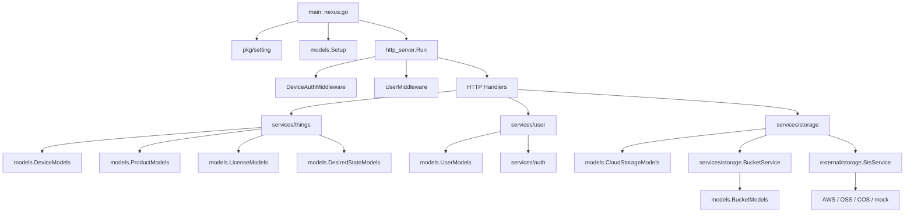

# Nexus

`Nexus` 是一个用 Go 编写的轻量级 IoT 后端，围绕“设备接入、设备状态同步、云存储配置与临时凭证下发、用户账号能力”展开。当前代码已经具备清晰的分层骨架，适合作为设备云平台原型或中小型物联网服务的基础仓库。

## 项目定位

从现有代码看，这个项目主要解决 4 类问题：

1. 设备激活与设备身份校验
2. 设备状态上报与期望状态同步
3. 云存储配置查询与 STS 临时凭证签发
4. 用户注册、登录与基础资料查询

HTTP 层使用 `gin`，数据访问层使用 `gorm + PostgreSQL`，对象存储侧抽象了 `AWS S3 / 阿里云 OSS / 腾讯云 COS / mock`。

## 架构总览



## 启动链路

程序入口很薄，启动顺序固定：

1. `pkg/setting.Setup()` 读取 `conf/app.ini`
2. `models.Setup()` 初始化 PostgreSQL 连接池
3. `http_server.Run()` 注册路由、中间件并启动 Gin HTTP 服务

这意味着当前工程是典型的“配置先行、数据库先连、HTTP 最后启动”的单体服务结构，没有额外的依赖注入容器，也没有异步 worker 进程。

## 分层说明

### 1. 入口层

- `nexus.go`
  只负责初始化配置、数据库和 HTTP 服务。

### 2. 配置层

- `pkg/setting/setting.go`
  负责加载应用基础配置，包括服务端口、运行模式、数据库连接等。
- `pkg/setting/things_config.go`
  负责加载设备侧配置，优先读取 `conf/things.ini`，找不到时回退到默认值。

配置可以分成两套：

- `app.ini`: 服务自身运行参数
- `things.ini`: 下发给设备或供设备能力使用的物模型/通信配置

### 3. HTTP 接入层

- `http_server/http_route.go`

这里集中做了三件事：

1. 注册路由
2. 做用户/设备认证
3. 把请求转发到 service 层

当前暴露的接口主要分为两组：

- 云端用户接口：`/cloud/...`
- 设备接口：`/things/...`

### 4. 业务服务层

#### `services/things`

这是当前最核心的领域模块，负责：

- 设备激活 `Active`
- 设备停用 `Deactivate`
- 查询设备详情/列表
- 设备状态上报 `HandleState`
- 期望状态拉取与确认 `FetchDesiredState / ConfirmDesiredState`

这个模块的特点是“设备领域模型比较集中”，`State`、`Features`、`DesiredState` 等结构都在这里定义和演化。

#### `services/user`

负责：

- 注册 `SignUp`
- 登录 `SignIn`
- 查询用户资料 `Get / GetByAccount`
- 用户搜索与更新
- 消息模型转换 `message.go`

认证令牌由 `services/auth/jwt.go` 生成与校验。

#### `services/storage`

负责两类事情：

- 管理设备与 bucket 的映射关系
- 根据 bucket provider 生成对象存储临时凭证

`CloudStorageService` 会组合：

- `models.CloudStorageModels`
- `BucketService`
- `external/storage.StsService`

因此它本质上是“业务配置 + 云厂商 STS 能力”的拼接层。

#### 其他 service

- `services/recording`
  已有云录制服务骨架与模型交互逻辑，但当前未接入 HTTP 路由。
- `services/license`
  提供 license 校验封装，核心逻辑已被 `things` 模块内聚复用。
- `services/geo`
  当前仍是占位实现。
- `services/device_features`
  当前仍是占位实现。
- `services/app`
  当前为空文件，仅保留目录结构。
- `services/state`
  当前目录存在，但尚未落地实现。

### 5. 数据访问层

- `models/`

这一层是标准的 GORM CRUD 封装，每个实体通常对应一个 `IxxxModels` 接口和一个实现体，例如：

- `DeviceModels`
- `UserModels`
- `ProductModels`
- `LicenseModels`
- `BucketModels`
- `CloudStorageModels`
- `DesiredStateModels`

当前模型层的职责边界比较清楚：

- 不承载复杂业务编排
- 负责数据库查询、更新、分页和少量乐观锁更新

### 6. 外部能力适配层

- `external/storage/storage.go`
- `external/storage/sts.go`

这是一个典型的 provider adapter 层，用统一接口屏蔽不同对象存储厂商的差异。当前支持：

- `aws`
- `oss`
- `cos`
- `mock`

它把“生成预签名 URL”和“签发临时访问凭证”从业务层剥离出来，便于以后扩展新的云厂商。

## 核心请求链路

### 用户登录链路

```text
POST /cloud/account/sign_in
  -> http_server.signIn
  -> services/user.SignIn
  -> models.UserModels.GetByAccount
  -> services/auth.GenerateToken
  -> 返回 JWT
```

### 设备激活链路

```text
POST /things/activate
  -> http_server.activateDevice
  -> services/things.Active
  -> 校验 license
  -> 校验 product.required_features
  -> 生成 device_id / secret_key
  -> models.DeviceModels.Create
  -> 返回 IoTDevice
```

### 设备状态上报链路

```text
POST /things/device/state
  -> DeviceAuthMiddleware
  -> http_server.handleState
  -> services/things.HandleState
  -> 合并旧状态与新状态
  -> models.DeviceModels.Update
```

### 存储凭证下发链路

```text
GET /things/device/credentials
  -> DeviceAuthMiddleware
  -> http_server.generateGetStorageCredentials
  -> services/storage.GetStorageCredentials
  -> 查 cloud_storage + bucket
  -> external/storage.StsService.GenerateCredentials
  -> 返回分 provider 的临时凭证
```

## 目录结构

```text
.
├── nexus.go                    # 程序入口
├── http_server/                # Gin 路由与中间件
├── pkg/setting/                # 配置加载
├── services/                   # 业务服务层
├── models/                     # GORM 数据模型与 CRUD
├── external/storage/           # 对象存储 provider 适配层
├── conf/                       # 本地配置
├── scripts/                    # 数据库与 API 测试脚本
├── test/                       # service/model 单元测试
└── examples/                   # 启动与配置示例
```

## 数据模型概览

从 `models` 和 `scripts/init_schema.sql` 可以看出，仓库当前围绕以下核心实体组织：

- `devices`: 设备主表，保存功能特性、当前状态、在线状态、位置等
- `desired_states`: 设备期望状态表，用于云端下发与设备确认
- `users`: 用户账号
- `products`: 产品定义，包含激活时要校验的 `required_features`
- `licenses`: 设备激活凭证
- `buckets`: 存储桶定义
- `cloud_storages`: 设备与存储桶的绑定关系
- `cloud_recordings` / `cloud_recording_plans`: 云录制相关能力
- `messages`: 用户消息中心

另外，`models/types.go` 对 PostgreSQL `POINT` 类型做了封装，便于在设备和用户上存储地理坐标。

## 快速启动

### 1. 准备 PostgreSQL

推荐直接使用仓库里的 `Justfile`：

```bash
just pg-setup
```

### 2. 启动服务

```bash
just run
```

默认监听端口：

```text
http://127.0.0.1:7070
```

### 3. 常用开发命令

```bash
just build
just run
just pg-test
just pg-clean
```

## 测试与辅助脚本

测试主要分成两层：

- `test/models`: 模型层测试
- `test/services`: 服务层测试

辅助脚本位于 `scripts/`：

- PostgreSQL 初始化
- API smoke test
- 认证头生成
- 本地联调脚本

## 当前实现边界与注意事项

这部分对接手开发很重要，建议先看：

1. 当前 HTTP 服务是单体结构，service 在 `http_server` 包内通过全局变量初始化，尚未做显式依赖注入。
2. `things`、`user`、`storage` 是当前真正跑通的三条主链路，其它模块很多仍处于预留或半接线状态。
3. 设备鉴权的真实实现以代码为准：当前中间件校验的是 `device-id` 和 `digest`，`digest` 由 `deviceID + secretKey` 的 HMAC-SHA256 Base64 结果构成，不校验时间戳。
4. `services/user` 当前使用明文密码比较；如果要进入生产，需要补密码哈希、密钥管理和更严格的 JWT 配置。
5. `HTTP_API_REFERENCE.md`、SQL 初始化脚本与当前 HTTP/模型实现之间存在少量不一致，后续最好统一以代码或一次完整接口回归为准。
6. 若要继续演进成完整平台，建议优先补齐依赖注入、配置解耦、错误码体系、日志/观测、消息队列消费和状态下发通道。

## 建议的后续演进方向

如果你准备继续建设这个仓库，推荐按下面顺序推进：

1. 对齐 README、HTTP 文档、SQL 脚本与真实实现
2. 给 `things` 和 `storage` 补集成测试
3. 把用户密码改成安全哈希存储
4. 用显式依赖注入替换全局 service 单例
5. 补齐消息、录制、geo、device_features 等未完成功能

## 相关文件

- `conf/app.ini`: 服务配置
- `conf/things.ini`: 设备配置
- `http_server/http_route.go`: 路由与中间件
- `services/things/`: 设备核心领域
- `services/storage/`: 存储与凭证核心逻辑
- `services/user/`: 用户与消息相关逻辑
- `scripts/init_schema.sql`: 本地数据库初始化
- `HTTP_API_REFERENCE.md`: 当前 API 参考文档
